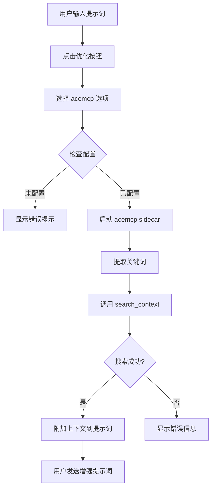

# Acemcp 集成使用指南

## ✅ 集成完成状态

### 已完成
- ✅ acemcp 打包为独立可执行文件 (35MB)
- ✅ 集成到 Claude Workbench 作为 Tauri sidecar
- ✅ 前端 UI 已添加优化选项
- ✅ Rust 后端通信模块已实现
- ✅ 编译通过（前端 + 后端）

### 文件清单
- `src-tauri/binaries/acemcp-sidecar-x86_64-pc-windows-msvc.exe` (35MB)
- `src-tauri/src/commands/acemcp.rs` (完整的 MCP 客户端)
- `src/lib/api.ts` (TypeScript API 接口)
- `src/components/FloatingPromptInput/` (UI 集成)

---

## 🚀 用户使用指南

### 步骤 1: 配置 Acemcp API

用户需要配置 API 端点和令牌。创建配置文件：

**Windows**:
```bash
# 创建配置目录
mkdir %USERPROFILE%\.acemcp

# 创建配置文件 %USERPROFILE%\.acemcp\settings.toml
```

**配置文件内容** (`~/.acemcp/settings.toml`):
```toml
BASE_URL = "https://your-api-endpoint.com"
TOKEN = "your-api-token-here"
BATCH_SIZE = 10
MAX_LINES_PER_BLOB = 800
WEB_ENABLED = false
WEB_PORT = 8888

TEXT_EXTENSIONS = [
    ".py", ".js", ".ts", ".jsx", ".tsx", ".java", ".go", ".rs",
    ".cpp", ".c", ".h", ".hpp", ".cs", ".rb", ".php", ".md",
    ".txt", ".json", ".yaml", ".yml", ".toml", ".xml", ".html",
    ".css", ".scss", ".sql", ".sh", ".bash"
]

EXCLUDE_PATTERNS = [
    ".venv", "venv", ".env", "env", "node_modules", ".git",
    "__pycache__", "dist", "build", ".idea", ".vscode",
    "*.pyc", "*.pyo", "*.pyd"
]
```

### 步骤 2: 使用语义搜索增强提示词

1. **打开 Claude Workbench**
2. **选择或创建项目会话**
3. **在提示词输入框中输入问题**
   - 例如: "修复登录认证的 bug"
   - 例如: "优化数据库查询性能"

4. **点击 "优化提示词" 按钮**
5. **选择 "🔍 添加项目上下文 (acemcp)"**
6. **等待 2-5 秒**（首次会索引项目）
7. **查看增强后的提示词**

### 步骤 3: 发送增强提示词

提示词会自动附加项目相关代码：

```
修复登录认证的 bug

--- 项目上下文 (来自 acemcp 语义搜索) ---
Path: src/auth/login.ts
...
10  export async function login(username: string, password: string) {
11    const response = await api.post('/auth/login', { username, password });
12    return response.data;
13  }
...
```

点击 "发送" 按钮，Claude 将基于完整上下文回答。

---

## 🔧 配置说明

### 必需配置
| 字段 | 说明 | 示例 |
|------|------|------|
| `BASE_URL` | API 端点地址 | `https://api.example.com` |
| `TOKEN` | 认证令牌 | `sk-xxx...` |

### 可选配置
| 字段 | 默认值 | 说明 |
|------|--------|------|
| `BATCH_SIZE` | 10 | 批量上传文件数 |
| `MAX_LINES_PER_BLOB` | 800 | 单个文件最大行数 |
| `WEB_ENABLED` | false | 是否启用 Web 管理界面 |
| `TEXT_EXTENSIONS` | [...] | 需要索引的文件扩展名 |
| `EXCLUDE_PATTERNS` | [...] | 排除的文件/目录模式 |

---

## 🧪 测试验证

### 测试 1: 验证 sidecar 可执行文件

```bash
# 直接运行测试
"C:\Users\Administrator\Desktop\claude-workbench\src-tauri\binaries\acemcp-sidecar-x86_64-pc-windows-msvc.exe" --help
```

应显示帮助信息。

### 测试 2: 验证配置文件

```bash
# 检查配置是否存在
type %USERPROFILE%\.acemcp\settings.toml
```

### 测试 3: 完整流程测试

1. 启动 Claude Workbench
2. 打开控制台查看日志 (F12)
3. 输入提示词并点击优化
4. 观察控制台输出：
   ```
   [acemcp] Starting acemcp sidecar...
   [acemcp] Sidecar path: C:\...\acemcp-sidecar-x86_64-pc-windows-msvc.exe
   [acemcp] Acemcp sidecar started successfully
   ```

---

## 🚨 故障排除

### 问题 1: "Failed to resolve sidecar path"
**原因**: 可执行文件不在正确位置

**解决**: 确认文件存在
```bash
dir "C:\Users\Administrator\Desktop\claude-workbench\src-tauri\binaries\acemcp-sidecar-x86_64-pc-windows-msvc.exe"
```

### 问题 2: "Failed to spawn sidecar"
**原因**: 可能被杀毒软件拦截

**解决**: 添加到白名单或关闭实时保护

### 问题 3: "BASE_URL must be configured"
**原因**: 配置文件未设置

**解决**: 创建 `~/.acemcp/settings.toml` 并填写 BASE_URL 和 TOKEN

### 问题 4: "Request timeout (30s)"
**原因**: API 响应慢或网络问题

**解决**:
- 检查 API 端点是否可访问
- 检查网络连接
- 增加超时时间

### 问题 5: "No relevant code context found"
**原因**: 搜索关键词与代码不匹配

**解决**:
- 使用更具体的技术术语
- 确保项目已被索引
- 检查 EXCLUDE_PATTERNS 是否排除了目标文件

---

## 📊 工作流程



---

## 🔐 安全与隐私

### 数据流向
1. **本地代码** → acemcp sidecar → **外部 API**（上传索引）
2. **搜索请求** → 外部 API → 返回结果

### 敏感信息
- **TOKEN**: 存储在用户主目录 `~/.acemcp/settings.toml`
- **代码内容**: 会上传到配置的 API 端点进行索引

⚠️ **重要提醒**：
- 确保 API 端点是可信的
- 不要在公共 API 上索引敏感代码
- TOKEN 应妥善保管

---

## 📈 性能指标

### 首次使用（含索引）
- **索引时间**: 取决于项目大小（约 1-10 分钟）
- **搜索时间**: 2-5 秒

### 后续使用（增量索引）
- **增量索引**: 仅处理新/修改文件（< 30 秒）
- **搜索时间**: 2-5 秒

### 资源占用
- **Sidecar 进程**: ~100-200MB 内存
- **应用增量**: +35MB（安装包大小）

---

## 🎯 下一步（可选改进）

### 短期
- [ ] 添加配置 UI（在设置页面中配置 BASE_URL/TOKEN）
- [ ] 添加索引进度显示
- [ ] 支持取消搜索操作

### 长期
- [ ] 支持多平台 sidecar (macOS, Linux)
- [ ] 缓存搜索结果
- [ ] 添加搜索历史
- [ ] 支持自定义排除模式 UI

---

## 📞 支持

如果遇到问题：
1. 检查 Tauri 控制台日志
2. 检查 `~/.acemcp/log/acemcp.log`
3. 提交 Issue 到项目仓库

---

**集成完成日期**: 2025-11-10
**Claude Workbench 版本**: 4.1.3
**Acemcp 版本**: 0.1.3
