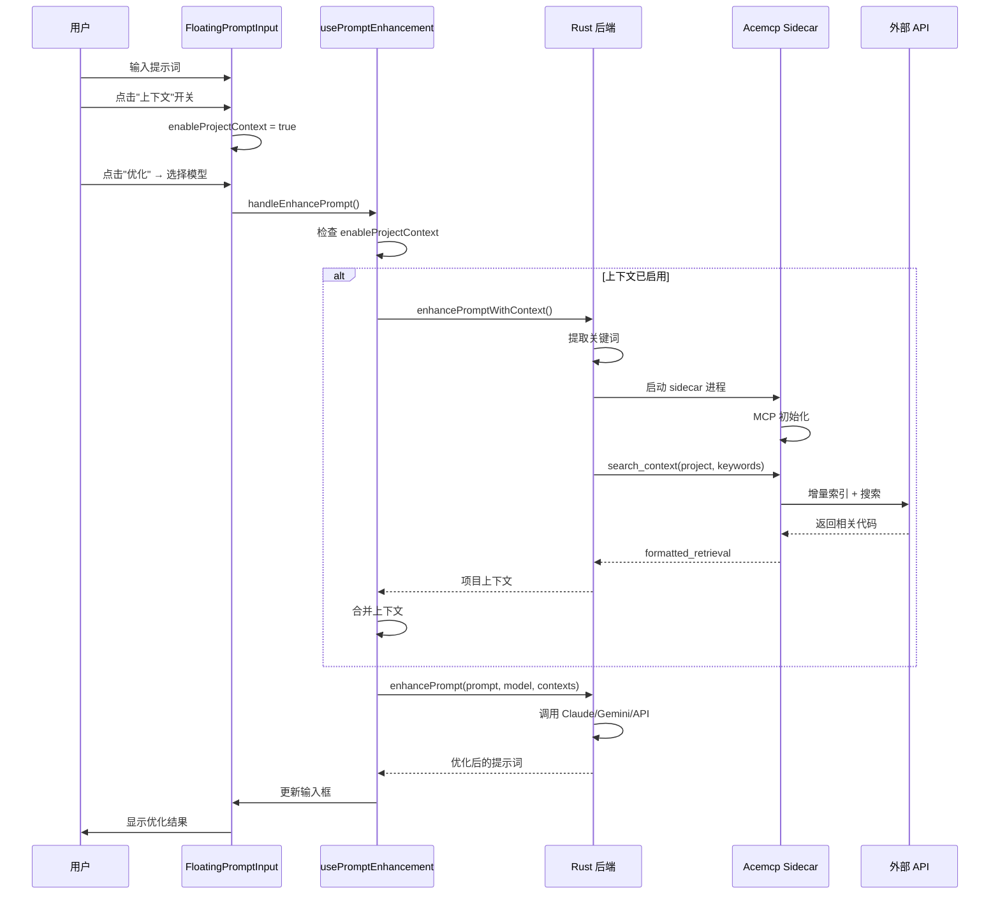

# ✨ Acemcp 语义搜索集成 - 完整说明

## 🎯 功能介绍

在 Claude Workbench 的提示词优化功能中集成了 **acemcp 语义搜索引擎**，自动为提示词添加项目代码上下文，解决新会话和历史会话中上下文缺失的问题。

### 核心优势

✅ **完全内置** - 无需用户安装 Python 或 acemcp
✅ **智能开关** - 灵活控制是否启用项目上下文
✅ **无缝集成** - 所有优化方法都支持（Claude/Gemini/第三方API）
✅ **自动注入** - 上下文自动附加到优化模型的输入中
✅ **配置简单** - 只需设置 API 端点和 Token

---

## 🚀 用户使用指南

### 第一步：配置 API（首次使用）

创建配置文件 `%USERPROFILE%\.acemcp\settings.toml`：

```toml
BASE_URL = "https://your-api-endpoint.com"
TOKEN = "your-api-token-here"
```

保存即可。

### 第二步：使用项目上下文优化

#### 操作流程

1. **打开 Claude Workbench**
2. **选择或创建项目会话**
3. **输入提示词**
   ```
   例如："修复用户登录功能的 bug"
   ```

4. **[关键] 点击 "上下文" 按钮**
   - 位置：输入框底部工具栏
   - 图标：🔧 Code2
   - 状态：
     - 灰色边框 = 未启用
     - 蓝色填充 = 已启用

5. **点击 "优化提示词" 按钮**
   - 选择优化模型：
     - 使用 Claude (本地CLI)
     - 使用 Gemini (本地CLI)
     - 使用第三方 API

6. **等待优化完成**
   - 系统会自动：
     1. 从提示词提取关键词（"登录"、"bug"等）
     2. 调用 acemcp 搜索项目中的相关代码
     3. 将搜索结果附加到对话上下文
     4. 发送给优化模型
     5. 返回优化后的提示词

7. **查看优化结果并发送**

---

## 🎨 界面展示

### 紧凑模式（底部工具栏）

```
┌────────────────────────────────────────────────┐
│ [向 Claude 提问...]                             │
├────────────────────────────────────────────────┤
│ $0.15  处理中  [ 🔧 上下文 ]  [ ✨ 优化 ▼ ] 发送 │
└────────────────────────────────────────────────┘
                      ↑              ↑
                  点击启用       选择模型
```

### 展开模式（全屏编辑器）

```
┌─────────────────────────────────────────────────────┐
│ [提示词输入框 - 多行]                                │
│                                                      │
├─────────────────────────────────────────────────────┤
│ [Plan Mode]  [ 🔧 启用上下文 ]  [ ✨ 优化提示词 ▼ ] 发送 │
└─────────────────────────────────────────────────────┘
                     ↑                    ↑
                 点击启用            选择模型
```

### 按钮状态

| 状态 | 外观 | 文字 |
|------|------|------|
| 未启用 | `[ 🔧 上下文 ]` | 灰色边框 |
| 已启用 | `[ 🔧 上下文 ]` | 蓝色填充 |

---

## 💡 使用场景

### 场景 1：修复项目 Bug（推荐启用上下文）

**提示词**：
```
修复用户登录后跳转失败的问题
```

**操作**：
1. ✅ 启用上下文开关
2. 点击优化 → Claude

**效果**：
- Acemcp 搜索登录、跳转相关代码
- 优化模型看到实际代码结构：
  ```
  Path: src/auth/login.ts
  10  export function handleLogin() {
  11    // ... 登录逻辑
  12    router.push('/home');  // 这里可能有问题
  13  }
  ```
- 返回针对性优化：
  ```
  请检查 src/auth/login.ts:12 的路由跳转逻辑。
  可能的问题：
  1. router 未正确初始化
  2. 路由路径错误
  3. 缺少权限验证
  ```

### 场景 2：添加新功能（推荐启用上下文）

**提示词**：
```
添加用户头像上传功能
```

**操作**：
1. ✅ 启用上下文
2. 点击优化 → Claude

**效果**：
- 搜索现有的文件上传、用户管理代码
- 了解项目架构（前后端分离？API 设计？）
- 返回符合项目规范的实现建议

### 场景 3：学习通用知识（无需启用上下文）

**提示词**：
```
解释 React hooks 的工作原理
```

**操作**：
1. ❌ 不启用上下文
2. 点击优化 → Claude

**效果**：
- 正常优化，不涉及项目代码
- 返回通用的技术解释

---

## 🔧 技术架构

### 系统组成

```
┌──────────────────────────────────────────────┐
│            Claude Workbench                   │
│  ┌────────────────────────────────────────┐  │
│  │  前端 (React)                           │  │
│  │  • FloatingPromptInput 组件             │  │
│  │  • enableProjectContext 开关状态        │  │
│  └────────────┬───────────────────────────┘  │
│               │ Tauri IPC                     │
│  ┌────────────▼───────────────────────────┐  │
│  │  Rust 后端                              │  │
│  │  • acemcp.rs - MCP 客户端               │  │
│  │  • enhance_prompt_with_context()        │  │
│  └────────────┬───────────────────────────┘  │
│               │ spawn child process           │
│  ┌────────────▼───────────────────────────┐  │
│  │  Acemcp Sidecar (35MB)                  │  │
│  │  • Python 3.14 runtime                  │  │
│  │  • acemcp 源码                          │  │
│  │  • 所有依赖 (httpx, mcp, loguru...)     │  │
│  └────────────┬───────────────────────────┘  │
└───────────────┼───────────────────────────────┘
                │ JSON-RPC over stdio
                │
                ▼ HTTP API
┌──────────────────────────────────────────────┐
│         外部语义搜索 API                      │
│  • 代码索引存储                               │
│  • 向量嵌入计算                               │
│  • 语义相似度搜索                             │
└──────────────────────────────────────────────┘
```

### 数据流

```
1. 用户启用开关 + 点击优化
   ↓
2. 前端调用 getProjectContext()
   ↓
3. Rust 启动 acemcp sidecar
   ↓
4. MCP 初始化（JSON-RPC）
   ↓
5. 调用 search_context 工具
   参数: {project_path, query: "提取的关键词"}
   ↓
6. Acemcp 执行：
   - 增量索引项目（仅新/修改文件）
   - 调用外部 API 搜索
   - 返回相关代码片段
   ↓
7. Rust 解析结果并格式化
   ↓
8. 返回到前端，附加到 context 数组
   ↓
9. 发送给优化模型：
   messages: [
     {role: "system", content: "你是提示词优化助手"},
     {role: "user", content: "对话历史..."},
     {role: "user", content: "项目上下文: Path: src/..."},
     {role: "user", content: "请优化：修复登录bug"}
   ]
   ↓
10. 优化模型返回针对性更强的优化提示词
```

---

## 📊 配置文件详解

### 位置
```
Windows: %USERPROFILE%\.acemcp\settings.toml
macOS/Linux: ~/.acemcp/settings.toml
```

### 配置项说明

```toml
# ========== API 配置（必需） ==========
BASE_URL = "https://your-api-endpoint.com"
# ↑ 语义搜索 API 的端点地址
# 必需：acemcp 依赖此 API 进行索引和搜索

TOKEN = "your-api-token-here"
# ↑ API 认证令牌
# 必需：用于身份验证

# ========== 索引配置（可选） ==========
BATCH_SIZE = 10
# ↑ 每批上传的文件数量
# 建议值：5-20，取决于网络速度

MAX_LINES_PER_BLOB = 800
# ↑ 单个文件分块的最大行数
# 建议值：500-1000，太大会影响搜索精度

# ========== 文件类型（可选） ==========
TEXT_EXTENSIONS = [".py", ".js", ".ts", ...]
# ↑ 需要索引的文件扩展名
# 添加你项目使用的语言

# ========== 排除规则（可选） ==========
EXCLUDE_PATTERNS = ["node_modules", ".git", ...]
# ↑ 不索引的文件/目录
# 减少索引时间和存储空间
```

---

## 🧪 测试指南

### 测试前准备

1. **确认 sidecar 存在**：
   ```bash
   ls "C:\Users\Administrator\Desktop\claude-workbench\src-tauri\binaries\acemcp-sidecar-x86_64-pc-windows-msvc.exe"
   ```
   应显示 35MB 文件。

2. **创建配置文件**：
   ```bash
   mkdir %USERPROFILE%\.acemcp
   notepad %USERPROFILE%\.acemcp\settings.toml
   ```
   填入 BASE_URL 和 TOKEN。

### 完整测试流程

```bash
# 1. 启动应用（开发模式）
cd C:\Users\Administrator\Desktop\claude-workbench
npm run tauri:dev

# 2. 在应用中：
#    - 打开项目会话
#    - 输入："优化错误处理逻辑"
#    - 点击"上下文"按钮（变蓝）
#    - 点击"优化" → "使用 Claude"
#    - 观察日志

# 3. 查看控制台日志 (F12)
#    应看到：
#    [getProjectContext] Fetching project context...
#    [acemcp] Starting acemcp sidecar...
#    [acemcp] Sidecar path: C:\...\acemcp-sidecar-x86_64-pc-windows-msvc.exe
#    [acemcp] Acemcp sidecar started successfully
#    [getProjectContext] Found context: X items
```

### 预期结果

**启用上下文前**：
```
请优化以下提示词：优化错误处理逻辑

→ 返回通用建议
```

**启用上下文后**：
```
请优化以下提示词：优化错误处理逻辑

【当前对话上下文】
项目上下文: Path: src/utils/errors.ts
10  export function handleError(error: Error) {
11    console.log(error);  // 没有日志记录！
12  }

→ 返回针对实际代码的具体建议
```

---

## 🔍 工作流程图



---

## 📋 文件清单

### 集成文件

| 路径 | 说明 | 大小/行数 |
|------|------|----------|
| `src-tauri/binaries/acemcp-sidecar-x86_64-pc-windows-msvc.exe` | Sidecar 可执行文件 | 35 MB |
| `src-tauri/src/commands/acemcp.rs` | MCP 客户端实现 | 405 行 |
| `src-tauri/src/commands/mod.rs` | 模块注册 | +1 行 |
| `src-tauri/src/main.rs` | Tauri 命令注册 | +3 行 |
| `src-tauri/tauri.conf.json` | Sidecar 配置 | +3 行 |
| `src/lib/api.ts` | TypeScript API | +50 行 |
| `src/components/FloatingPromptInput/hooks/usePromptEnhancement.ts` | Hook 逻辑 | +60 行 |
| `src/components/FloatingPromptInput/index.tsx` | UI 集成 | +30 行 |

### 文档文件

- `README_ACEMCP.md` - 本文档（完整说明）
- `ACEMCP_FINAL_GUIDE.md` - 用户使用指南
- `ACEMCP_SIDECAR_INTEGRATION.md` - 技术实现文档
- `ACEMCP_INTEGRATION_COMPLETE.md` - 集成完成报告

---

## 🔧 故障排除

### 常见问题

#### 1. "上下文"按钮不显示

**原因**：未选择项目会话

**解决**：确保当前会话关联了项目路径（projectPath 不为空）

---

#### 2. "Failed to spawn sidecar: 系统找不到指定的路径"

**原因**：Sidecar 文件不存在或路径错误

**解决**：
```bash
# 检查文件是否存在
dir "C:\Users\Administrator\Desktop\claude-workbench\src-tauri\binaries\acemcp-sidecar-x86_64-pc-windows-msvc.exe"

# 如果不存在，重新复制
copy "C:\Users\Administrator\Desktop\acemcp\dist\acemcp-sidecar.exe" "C:\Users\Administrator\Desktop\claude-workbench\src-tauri\binaries\acemcp-sidecar-x86_64-pc-windows-msvc.exe"
```

---

#### 3. "BASE_URL must be configured"

**原因**：配置文件未创建或内容错误

**解决**：
```bash
# 重新创建配置
mkdir %USERPROFILE%\.acemcp
(
echo BASE_URL = "https://your-api.com"
echo TOKEN = "your-token"
) > %USERPROFILE%\.acemcp\settings.toml
```

---

#### 4. "Request timeout (30s)"

**原因**：首次索引项目或网络慢

**解决**：
- 首次使用需要索引整个项目（1-10 分钟，仅一次）
- 后续使用为增量索引（数秒）
- 检查网络连接和 API 可用性
- 如需加速，可在配置中添加更多 EXCLUDE_PATTERNS

---

#### 5. 启用上下文后仍然没有项目代码

**原因**：关键词提取失败或搜索无结果

**解决**：
- 使用更具体的技术术语
- 例如：将 "修一下" 改为 "修复用户认证模块的 token 验证逻辑"
- 检查 EXCLUDE_PATTERNS 是否排除了目标文件

---

## 📊 性能与限制

### 性能指标

| 阶段 | 首次 | 后续 |
|------|------|------|
| Sidecar 启动 | ~1s | ~1s |
| 项目索引 | 1-10min | 5-30s (增量) |
| 搜索上下文 | 2-5s | 2-5s |
| 优化提示词 | 3-10s | 3-10s |
| **总耗时** | **1-11min** | **10-40s** |

### 限制

| 项目 | 限制 | 说明 |
|------|------|------|
| 上下文长度 | 3000 字符 | 超出部分截断 |
| 关键词数量 | 10 个 | 自动提取前 10 个 |
| 搜索超时 | 30 秒 | 避免长时间等待 |
| 平台支持 | Windows | macOS/Linux 需单独打包 |

---

## 🔐 安全注意事项

### 数据隐私

⚠️ **重要警告**：

1. **代码会上传到外部 API**
   - Acemcp 会将项目代码上传到配置的 BASE_URL 进行索引
   - 确保 API 端点是可信的
   - **不要在公共 API 上索引敏感/私有代码**

2. **Token 安全**
   - 存储在 `~/.acemcp/settings.toml`（明文）
   - 设置文件权限，防止未授权访问
   - 不要将配置文件提交到 Git

3. **搜索查询**
   - 仅发送提取的关键词到 API
   - 不发送完整提示词
   - 不包含对话历史

### 最佳安全实践

✅ **推荐做法**：
- 使用自建的 API 服务
- 定期更新 TOKEN
- 审查 EXCLUDE_PATTERNS，确保敏感文件不被索引
- 仅在内网环境使用

❌ **不推荐**：
- 在公共 API 上索引公司代码
- 共享 TOKEN
- 索引包含密钥/密码的代码

---

## 📝 开发者指南

### 修改关键词提取逻辑

编辑 `src-tauri/src/commands/acemcp.rs`：

```rust
fn extract_keywords(prompt: &str) -> String {
    let stopwords = [
        "请", "帮我", "我想",  // 添加更多停用词
        "the", "a", "an",
    ];

    let words: Vec<&str> = prompt
        .split_whitespace()
        .filter(|w| {
            w.len() > 2 && !stopwords.contains(&w.to_lowercase().as_str())
        })
        .take(10)  // 修改关键词数量
        .collect();

    words.join(" ")
}
```

### 修改上下文长度限制

在 `usePromptEnhancement.ts` 中：

```typescript
const result = await api.enhancePromptWithContext(
  prompt.trim(),
  projectPath,
  5000  // 改为 5000 字符
);
```

### 添加调试日志

在 Rust 代码中：

```rust
info!("Debug info: {}", some_variable);
debug!("Detailed debug: {:?}", some_struct);
```

在前端代码中：

```typescript
console.log('[MyComponent] Debug:', data);
```

---

## 🎊 总结

### 集成成果

- ✅ **完全独立**：无需用户安装任何依赖
- ✅ **智能开关**：用户灵活控制是否使用
- ✅ **全面支持**：所有优化方法都能利用项目上下文
- ✅ **配置简单**：仅需 BASE_URL 和 TOKEN
- ✅ **编译通过**：前后端全部正常

### 技术亮点

- 🎯 PyInstaller 打包（Python → 单一 EXE）
- 🎯 Tauri Sidecar 集成（跨平台二进制）
- 🎯 MCP JSON-RPC 协议实现
- 🎯 智能关键词提取
- 🎯 异步 stdio 通信

### 用户价值

- 💡 **更准确的优化**：基于实际项目代码
- 💡 **节省时间**：无需手动复制代码
- 💡 **提高质量**：Claude 能看到完整上下文
- 💡 **灵活控制**：一键启用/禁用

---

**🎉 集成完成，可以开始使用了！**

运行 `npm run tauri:dev` 并测试功能，有问题随时告诉我。
